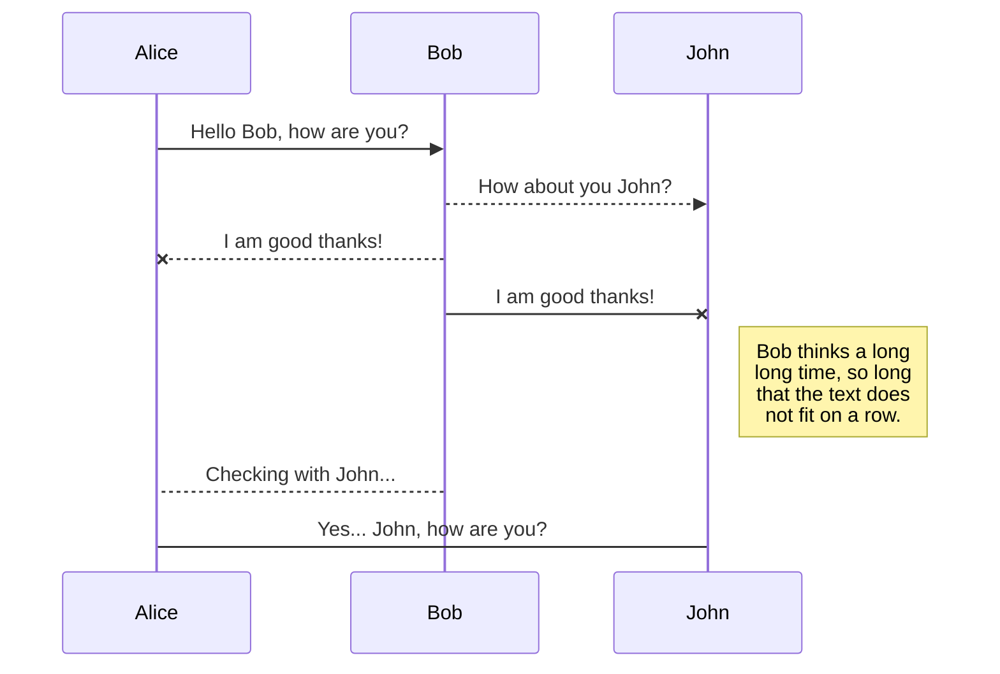
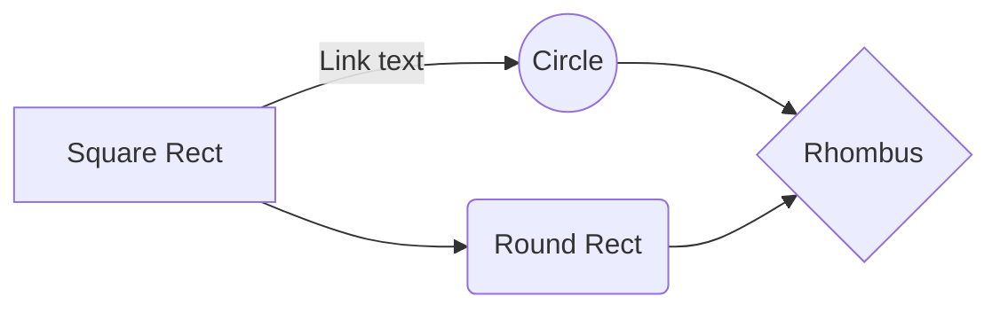

# Proyecto-DWFS-Equipo8
# Market_Place!
About
# Requerimientos
> Vendedor
- Permitir a los usuarios interesados en vender, registrarse y documentar su información de tienda y contacto.
- Publicar artículos para su venta a los vendedores.
> General
- Visualizar artículos en venta, público en general.
> Comprador
- Permitir a los usuarios interesados en comprar, registrarse y poder realizar compras de artículos.
- Permitir escribir reseñas del artículo post-venta a compradores.

## Historias de Usuario

## Casos de Uso

## Actores
- Comprador
- Vendedor
- Administrador

## SmartyPants

SmartyPants converts ASCII punctuation characters into "smart" typographic punctuation HTML entities. For example:

|                |ASCII                          |HTML                         |
|----------------|-------------------------------|-----------------------------|
|Single backticks|`'Isn't this fun?'`            |'Isn't this fun?'            |
|Quotes          |`"Isn't this fun?"`            |"Isn't this fun?"            |
|Dashes          |`-- is en-dash, --- is em-dash`|-- is en-dash, --- is em-dash|

## UML diagrams

You can render UML diagrams using [Mermaid](https://mermaidjs.github.io/). For example, this will produce a sequence diagram:

And this will produce a flow chart:

