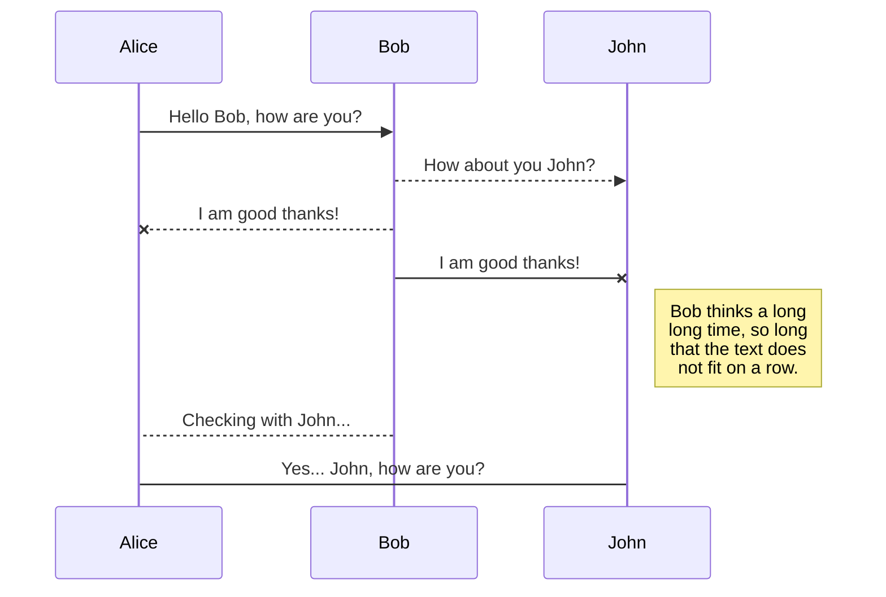
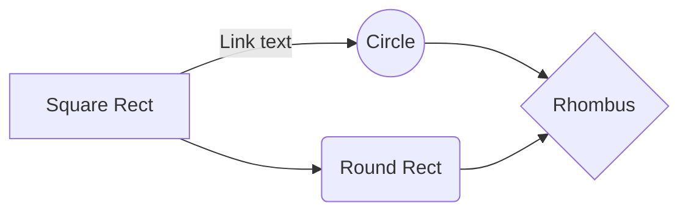

# Proyecto-DWFS-Equipo8

# Bazaar!
Bazaar! es una plataforma de marketplace que provee servicios centralizados para la compra-venta de artículos, colaborando con los usuarios creando un ambiente de valor para llevar a cabo trueques y compra-venta de forma segura y responsable.
#### Alcance
Establecer una plataforma tipo marketplace con dos actores principales (Comprador y Vendedor), quienes podrán interactúar entre sí una vez formalizado la acción de compra sobre el artículo de interés publicado por el vendedor.
Se espera que en la plataforma se consulten artículos aún sin ser miembro identificado.

#### Fuera del alcance
-Chat de comunicación de forma interna, sólo se compartirán los datos de contacto.
-Servicio externo ó interno de sistema de pago.

# Teammates 8

Antonio Labra Guerrero  | Ian Axel Cuevas Olvera  | David Dorantes Torres  | Luis Alonso Marañón Solorio  | Brayan Eleazar Cabrera Lejona  |
----------------------- | ----------------------- | ----------------------- |  ----------------------- |  ----------------------- |
 |  |  |  | 

# Requerimientos
> Vendedor
- Permitir a los usuarios interesados en vender, registrarse y documentar su información de tienda y contacto.
- Publicar artículos para su venta a los vendedores.
> General
- Visualizar artículos en venta, público en general.
> Comprador
- Permitir a los usuarios interesados en comprar, registrarse y poder realizar compras de artículos.
- Permitir escribir reseñas del artículo post-venta a compradores.

## Historias de Usuario

## Casos de Uso

## Actores
- Comprador
- Vendedor
- Administrador

## UML diagrams

You can render UML diagrams using [Mermaid](https://mermaidjs.github.io/). For example, this will produce a sequence diagram:

And this will produce a flow chart:

