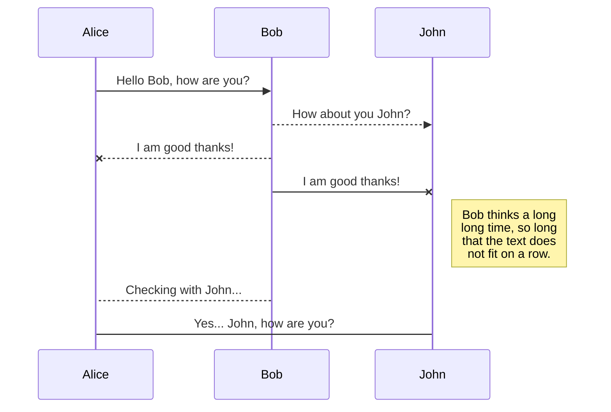
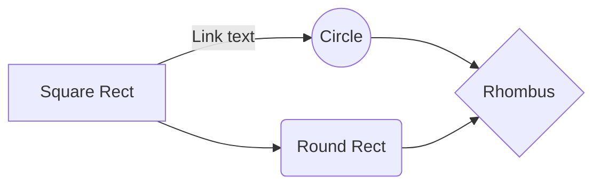

# Proyecto-DWFS-Equipo8

# Market_Place!
About

# Teammates 8
Antonio Labra Guerrero

> Ian Axel Cuevas Olvera

> David Dorantes Torres

> Luis Alonso Marañón Solorio

> Brayan Eleazar Cabrera Lejona

# Requerimientos
> Vendedor
- Permitir a los usuarios interesados en vender, registrarse y documentar su información de tienda y contacto.
- Publicar artículos para su venta a los vendedores.
> General
- Visualizar artículos en venta, público en general.
> Comprador
- Permitir a los usuarios interesados en comprar, registrarse y poder realizar compras de artículos.
- Permitir escribir reseñas del artículo post-venta a compradores.

## Historias de Usuario

## Casos de Uso

## Actores
- Comprador
- Vendedor
- Administrador

## UML diagrams

You can render UML diagrams using [Mermaid](https://mermaidjs.github.io/). For example, this will produce a sequence diagram:

And this will produce a flow chart:

